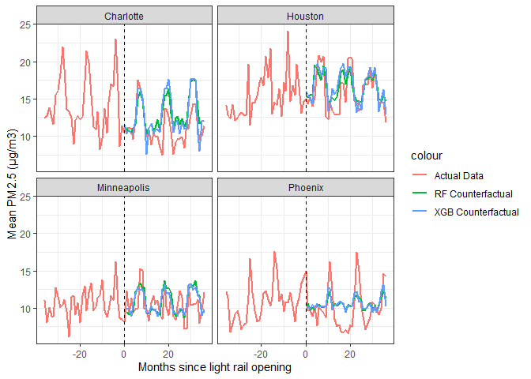
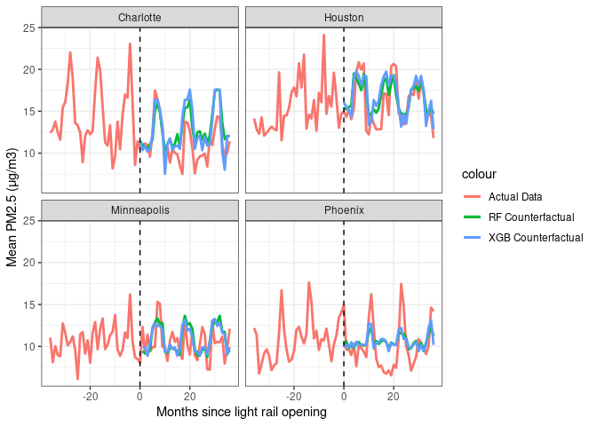
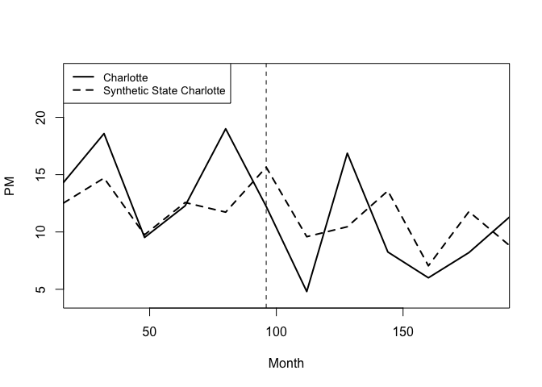

# Charlotte Lynx Blue Line’s Impact on Air Pollution
Samirah Huda and Landon Thomas

## Research Question

What effect does the Lynx Blue Line light rail have on urban air
pollution in Charlotte, South Carolina?


## Data

**PM2.5 Data from SEDAC**
We obtained daily PM2.5 concentrations for the contiguous United States
at 1 km spatial resolution for the years 2000 to 2016 in GeoTIFF format
from NASA’s Socioeconomic Data and Applications Center (SEDAC). We then
found the coordinates of the city center for the target city and each
control city, and we created a buffer with a 10 kilometer radius around
each city center. Finally, we cropped and adjusted the projections of
the GeoTIFF files and extracted the PM2.5 data, creating a CSV file of
the data set containing the monthly average PM2.5 concentrations for
each city.


**Meteorology data from NOAA**
We complied 3 daily weather variables, average wind, precipitation, and
average temperature in 4 cities from 2000 to 2016. The weather variables
were recorded by NOAA from monitoring stations at the airport in each
city.

## Estimation Methodology & Results

**Machine Learning to Compare Predicted Baseline with Actual Data**


We use data before Charlotte’s light rail opening to predict future
PM2.5 levels had the light rail not opened. We then compare the
predicted PM2.5 data with actual data after light rail opening data.

This comparison allowed us to gain more insight about whether or not the
PM2.5 concentrations would have been higher if the light rail had not
opened.

Machine learning methods we used include the Random Forest model and the
XGBoost model.

Create training data

``` r
#install.packages("rmarkdown")
#install.packages("terra")
#install.packages("tidyverse")
#install.packages("dplyr")
library("tidyverse")
library("dplyr")
library("leaps")
library("rpart")
library("rpart.plot")
library("vip")
library("ranger")
library("xgboost")

updated <- read.csv("merged_pm25.csv")
```

Clean data to feed into machine learning models

``` r
updated2<-updated %>%
  mutate(city=as.factor(city))%>%
  dplyr::select(-temp, -date, -meanpm25)
```

``` r
df2<-updated2 %>%
  filter(lr_month<=36 & lr_month>= -36)

df3<-df2 %>%
  filter(lr_op < 1) %>%
  dplyr::select(-lr_op, -lr_month)

sapply(lapply(df2, unique), length)
```

                      city                  month                   year 
                         4                     12                     12 
           new_monthly_avg    Frost_Day_Frequency          Precipitation 
                       292                     97                    205 
          Mean_Temperature         Vapor_Pressure Cloud_Cover_Percentage 
                       171                    135                    169 
                       pop                    gdp                  lr_op 
                        28                     28                      2 
                  lr_month                   fdf2                     p2 
                        73                     97                    205 
                       mt2                    vp2                   ccp2 
                       158                    135                    169 
                      pop2                   gdp2 
                        28                     28 

Split data in to test and train group

We used data before Charlotte’s light rail opening to predict future
PM2.5 levels had the light rail not opened. We then compared the
predicted PM2.5 data with actual data after the light rail opening data.
This comparison allowed us to gain more insight about whether or not the
PM2.5 concentrations would have been higher if the light rail had not
opened.

Machine learning methods we used include the Random Forest model and the
XGBoost model.

Create training data

``` r
library("tidyverse")
library("dplyr")
library("leaps")
library("rpart")
library("rpart.plot")
library("vip")
library("ranger")
library("xgboost")

updated <- read.csv("merged_pm25.csv")

# adjust data for machine learning models
updated2<-updated %>%
  mutate(city=as.factor(city))%>%
  dplyr::select(-temp, -date, -meanpm25)

# Machine Learning Models:

# Upload and clean data
df2<-updated2 %>%
  filter(lr_month<=36 & lr_month>= -36)

df3<-df2 %>%
  filter(lr_op < 1) %>%
  dplyr::select(-lr_op, -lr_month)

sapply(lapply(df2, unique), length)
```

                      city                  month                   year 
                         4                     12                     12 
           new_monthly_avg    Frost_Day_Frequency          Precipitation 
                       292                     97                    205 
          Mean_Temperature         Vapor_Pressure Cloud_Cover_Percentage 
                       171                    135                    169 
                       pop                    gdp                  lr_op 
                        28                     28                      2 
                  lr_month                   fdf2                     p2 
                        73                     97                    205 
                       mt2                    vp2                   ccp2 
                       158                    135                    169 
                      pop2                   gdp2 
                        28                     28 

``` r
set.seed(112)

shuffled<-df3 %>% sample_frac(size=1, replace=FALSE)

train<-shuffled %>%
  dplyr::slice(1:100)

test<-shuffled %>%
  dplyr::slice(101:145)
  
 ```

Estimate RMSE from the Random Forest Model

``` r
model4 <- ranger(new_monthly_avg ~ ., data=train, importance='impurity')
v1 <- vip(model4)
v1
```



In this chart, the importance represents how heavily each variable
influences the model. The higher the importance, the higher the impact
that variable has. Here, the variable that most heavily influenced the
results is the city. The second most influential variable is population,
the third most is vapor pressure squared, and so on.

``` r
#rf model evaluation
predict_test<-predict(model4, test)

rmse_test_rf<-sqrt(mean(test$new_monthly_avg-predict_test$predictions)^2)

rmse_test_rf
```

    [1] 0.2596259

``` r
#create data for the graph
openlr <- updated %>%
  filter(lr_op>0) %>%
  mutate(city=as.factor(city))%>%
  dplyr::select(-temp, -date, -meanpm25) %>%
  dplyr::select(-lr_op, -lr_month)
  
# rf model with all data
predict_test<-predict(model4, openlr)

rf_pred<-predict_test$predictions
rf_df<-cbind(openlr, rf_pred)
```

Estimate RMSE with the XGBoost model

``` r
# Split data in to test and train group
set.seed(112)

shuffled<-df3 %>% sample_frac(size=1, replace=FALSE)
all_data <- df2 %>%
  dplyr::select(-lr_op)
all_data2 <- data.matrix(all_data)

train<-shuffled %>%
  dplyr::slice(1:100)

test<-shuffled %>%
  dplyr::slice(101:145)

#define predictor and response variables in training set
train_x = data.matrix(train[, -4])
train_y = train[,4]

#define predictor and response variables in testing set
test_x = data.matrix(test[, -4])
test_y = test[, 4]

#define final training and testing sets
xgb_train = xgb.DMatrix(data = train_x, label = train_y)
xgb_test = xgb.DMatrix(data = test_x, label = test_y)

watchlist = list(train=xgb_train, test=xgb_test)

#fit XGBoost model
xgb_model = xgboost(data = xgb_train, max.depth = 3, nrounds = 14, verbose = 0)
predict_xgb<-predict(xgb_model, xgb_test)
rmse_test_xgb<-sqrt(mean(test_y-predict_xgb)^2)

rmse_test_xgb

```
    [1] 0.4430286

``` r
 #create data for the graph
openlr <- updated %>%
  filter(lr_op>0) %>%
  mutate(city=as.factor(city))%>%
  dplyr::select(-temp, -date, -meanpm25) %>%
  dplyr::select(-lr_op, -lr_month)

openlr_matrix <- data.matrix(openlr)

all_x = data.matrix(openlr_matrix[, -4])
all_y = openlr_matrix[, 4]

xgb_all = xgb.DMatrix(data = all_x, label = all_y)

# rf model with all data
predict_all_xgb<-predict(xgb_model, xgb_all)

xgb_df<-cbind(rf_df, predict_all_xgb)   
```    

Plot predicted PM2.5 with actual data
``` r    
openlr <- updated %>%
  filter(lr_op>0)

lr_removed <- df2 %>%
  dplyr::select(-lr_op)

# rf model with all data
model5 <- ranger(new_monthly_avg ~ ., data=lr_removed, importance='impurity')
predict_test<-predict(model4, lr_removed)

# xgb model with all data
matrix <- data.matrix(lr_removed)

my <- df2 %>%
  dplyr::select(lr_month, month, year, city)

pred_df<-merge(xgb_df, my, by=c("month","year", "city"), all.x=TRUE)

p <- ggplot() + 
  geom_line(data = df2, aes(x = lr_month, y = new_monthly_avg, color = "Actual Data"), linewidth=1) + facet_wrap(~ city) +
  geom_line(data=pred_df, aes(x = lr_month, y = rf_pred, color = "RF Counterfactual"), linewidth=1) + facet_wrap(~ city) +
  geom_line(data=pred_df, aes(x = lr_month, y = predict_all_xgb, color = "XGB Counterfactual"), linewidth=1) + facet_wrap(~ city) +
  xlab("Months since light rail opening") + ylab("Mean PM2.5 (μg/m3)") + geom_vline(xintercept=0, linetype="dashed")+theme_bw()

p
```

    Warning: Removed 59 rows containing missing values (`geom_line()`).
    Removed 59 rows containing missing values (`geom_line()`).



This plot compares the actual concentrations of PM2.5, and the predicted
levels of PM2.5 predicted by both the Random Forest model and the
XGBoost model, before and after light rails opened in Charlotte,
Houston, Minneapolis, and Phoenix.

    
**Using Synthetic Control to Compare PM2.5 Changes with Counterfactual Cities**    
    
We gathered a list of cities with similar characteristics to Charlotte and downloaded EPA PM2.5 data for each of the cities to gather a rough idea of which city had a similar trend to Charlotte, before receiving the treatment. This allowed us to build a counterfactual control city to estimate the effect of the treatment. The Synth package was used in the creation of the counterfactual.

Importing the daily EPA PM2.5 data.

    
``` r
for(x in 2000:2016){
  assign(paste0("df",x), read.csv(paste0("/Users/landonthomas/Desktop/Junior Year/Fall Semester/F23 PRM/Data/daily_88101_",x,".csv")))
}

```

Adjusting county and state codes for cities that span multiple counties or states.

``` r
dfMonth <- dfChar %>%
  select(Arithmetic.Mean, State.Code, County.Code, Latitude, Longitude, City.Name, Date.Local) %>%
  mutate(Year = as.numeric(substr(Date.Local, 0, 4))) %>%
  mutate(Month = as.numeric(substr(Date.Local, 3, 4))*12+as.numeric(substr(Date.Local, 6,7))) %>%
  mutate(County.Code = ifelse(City.Name == "Columbus", 87, County.Code)) %>%
  mutate(County.Code = ifelse(City.Name == "Jacksonville", 31, County.Code)) %>%
  mutate(County.Code = ifelse(City.Name == "Kansas City", 209, County.Code)) %>%
  mutate(State.Code = ifelse(City.Name == "Kansas City", 20, State.Code))

dfMonth2 <- dfMonth %>% 
  group_by(Month, City.Name, County.Code) %>%
  summarize(PM = mean(Arithmetic.Mean))
  
```
Creating a balance panel to combine with cleaned weather data.    
    
``` r
vector <- as.data.frame(table(dfMonth2$Month))

County.Code <- unique(dfMonth2$County.Code)

Month <- unique(dfMonth2$Month)

bp <- crossing(County.Code, Month)

bp2 <- merge(bp, dfMonth2, by=c("Month","County.Code"), all.x = TRUE)

meandf <- dfMonth2 %>%
  group_by(County.Code, City.Name) %>%
  summarize(meanAllTime = mean(PM)) %>%
  rename(CN=City.Name)

bp3 <- merge(bp2, meandf, by=c("County.Code"), all.x = TRUE)


bp4 <- bp3 %>%
  mutate(PM = ifelse(is.na(PM), meanAllTime, PM)) %>%
  mutate(City.Name=ifelse(is.na(City.Name), CN, City.Name))

bp5 <- bp4 %>%
  mutate(lr_op = ifelse(Month > 7*12+11, 1, 0))
```

Cleaning weather data.

``` r
weather2 <- weather %>%
  mutate(first = word(NAME, 1))

weather3 <- weather2 %>%
  mutate(City.Name = ifelse(first == "JOHN", "COLUMBUS", first)) %>%
  mutate(City.Name = ifelse(first == "KANSAS", "KANSAS CITY", City.Name)) %>%
  mutate(City.Name = ifelse(first == "ST", "TAMPA", City.Name)) %>%
  mutate(City.Name = ifelse(first == "MCCARRAN", "LAS VEGAS", City.Name))

weather4 <- weather3 %>%
  mutate(nameLower = tolower(City.Name)) %>%
  mutate(Month=as.numeric(substr(DATE, 3, 4))*12+as.numeric(substr(DATE, 6,7))) %>%
  dplyr::select(TAVG, AWND, PRCP, nameLower, Month)
```

Combining weather and PM2.5 data for each city.

``` r
prep2 <- bp5 %>%
  mutate(nameLower = tolower(City.Name))

prep3 <- merge(prep2, weather4, by = c("nameLower", "Month") , all.x=TRUE)

prep4 <- prep3 %>%
  mutate(T = ifelse(City.Name == "Charlotte" & lr_op == 1, 1 , 0)) %>%
  filter(County.Code!=163 & County.Code!=7)
```

Creating the synthetic control using the Synth package.

``` r
library("Synth")
```

    ##
    ## Synth Package: Implements Synthetic Control Methods.

    ## See https://web.stanford.edu/~jhain/synthpage.html for additional information.


``` r
prep4 <- read.csv("prep4.csv")
dataprep.out <- dataprep(prep4, 
                         time.predictors.prior = 1:(8*12),
                         predictors.op = "mean",
                         predictors = c("AWND", "PRCP"),
                         dependent = "PM",
                         unit.variable = "County.Code",
                         unit.names.variable = "City.Name",
                         time.variable = "Month",
                         treatment.identifier = 119,
                         controls.identifier = c(3,31,57,61,79,87,95,97,209),
                         time.optimize.ssr = 1:(8*12),
                         time.plot = 1:12*16)

synth.out <- synth(dataprep.out)
```


    X1, X0, Z1, Z0 all come directly from dataprep object.


    **************** 
     searching for synthetic control unit  
     

    **************** 
    **************** 
    **************** 

    MSPE (LOSS V): 12.04959 


    solution.v:
     3.46696e-05 0.9999653 

    solution.w:
     0.1137685 0.2627167 0.04326885 0.3113394 0.06198184 0.05731318 0.04390384 0.04537258 0.06033523 

``` r
print(synth.tables   <- synth.tab(
  dataprep.res = dataprep.out,
  synth.res    = synth.out)
)
```

    $tab.pred
         Treated Synthetic Sample Mean
    AWND   2.515     3.175       3.575
    PRCP  85.531    85.530      83.477

    $tab.v
         v.weights
    AWND 0        
    PRCP 1        

    $tab.w
        w.weights   unit.names unit.numbers
    3       0.114    Las Vegas            3
    31      0.263 Jacksonville           31
    57      0.043        Tampa           57
    61      0.311   Cincinnati           61
    79      0.062    Milwaukee           79
    87      0.057     Columbus           87
    95      0.044      Orlando           95
    97      0.045 Indianapolis           97
    209     0.060  Kansas City          209

    $tab.loss
               Loss W   Loss V
    [1,] 3.636059e-05 12.04959

Graphing the synthetic control versus Charlotte with the light rail
opening date.

``` r
path.plot(synth.res    = synth.out,
          dataprep.res = dataprep.out,
          Ylab         = c("PM"),
          Xlab         = c("Month"),
          Legend       = c("Charlotte","Synthetic State Charlotte"),
          Legend.position = c("topleft")
)

abline(v   = 8*12,
       lty = 2)
```




A linear combination of the cities using a weighted average, with
Cincinnati having the most weight, predicts the PM2.5 trends in
Charlotte if the city hadn’t received the treatment. One limitation of
the model is there are some big spikes in the PM2.5 levels in Charlotte
that the synthetic control city doesn’t account for, so some of the
seasonality variation hasn’t been captured by the model.

## Conclusion

Based on the machine learning models, the higher the RMSE (error
squared), the less accurate the model is. In this study, the Random
Forest Model produced a RMSE value of 0.2596, while the XGBoost model
produced a RMSE value of 0.4430. Therefore, in this study, the Random
Forest Model proved to be more accurate for predicting PM2.5
concentrations in these four cities had light rails not opened.

## 
